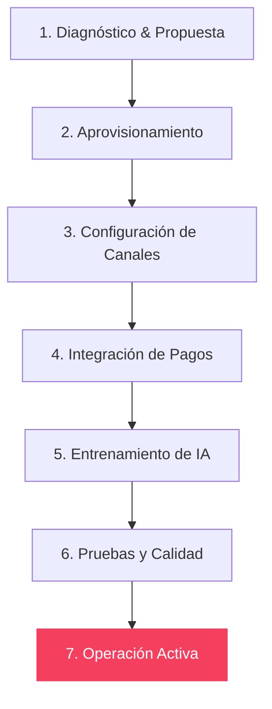

# Modelo Operativo de Implementación — Mercenario

Este documento define el flujo completo que sigue un cliente desde que acepta una propuesta comercial hasta que su instancia entra en producción en la plataforma Mercenario.

---

## Flujo del Ciclo de Vida del Cliente

---

## 1. Diagnóstico & Propuesta

*   **Objetivo:** Identificar los cuellos de botella operativos de la empresa del cliente y formalizar el acuerdo comercial.
*   **Responsable:** Mercenario (Equipo Comercial).
*   **Información Requerida:** 
    *   Nombre de la empresa y del representante.
    *   Problema operativo principal (ej. pérdida de citas, conciliación manual, fuga de leads).
    *   Presupuesto aproximado y volumen transaccional mensual.
*   **Entregables:**
    *   Propuesta técnica y comercial aprobada.
    *   Contrato firmado digitalmente.
*   **Criterio de Avance:** Firma del contrato y primer abono/pago de habilitación.
*   **Automatizaciones en este punto:**
    *   Envío automático del contrato a través de firma digital electrónica.
    *   Registro del lead en el CRM comercial interno de Mercenario.

---

## 2. Aprovisionamiento

*   **Objetivo:** Crear la infraestructura del cliente e inicializar los entornos de desarrollo.
*   **Responsable:** IA / DevOps.
*   **Información Requerida:** 
    *   Identificador del cliente (`client_id`).
    *   Nicho de la industria (Salud, Gastronomía, Comercio, etc.).
*   **Entregables:**
    *   Base de datos Supabase dedicada y configurada.
    *   Instancia en Vercel aprovisionada para la URL de desarrollo del cliente.
*   **Criterio de Avance:** Infraestructura desplegada con variables de entorno básicas activas.
*   **Automatizaciones en este punto:**
    *   Ejecución automática de scripts SQL de base de datos para la industria respectiva.
    *   Creación del proyecto de hosting y asignación de subdominio temporal (ej: `cliente.mercenario.io`).

---

## 3. Configuración de Canales

*   **Objetivo:** Configurar los puntos de contacto directo entre la empresa y sus clientes finales.
*   **Responsable:** Cliente (proporciona accesos) / Mercenario (configura).
*   **Información Requerida:**
    *   Dominio definitivo (ej. `clinicaelegante.cl`).
    *   Cuentas de correo para notificaciones.
    *   Número de WhatsApp destinado a la operación.
*   **Entregables:**
    *   Dominio enlazado y certificado SSL activo.
    *   WhatsApp Business API vinculado al orquestador de agentes de Mercenario.
*   **Criterio de Avance:** Validaciones de DNS de dominio aprobadas y envío exitoso del primer mensaje de prueba por WhatsApp.
*   **Automatizaciones en este punto:**
    *   Monitoreo automático de estado DNS.
    *   Registro de webhook de WhatsApp Business.

---

## 4. Integración de Pagos y Caja

*   **Objetivo:** Vincular la pasarela de cobros y el flujo fiscal de facturación.
*   **Responsable:** Cliente (creación de cuentas en pasarelas) / Mercenario (integración técnica).
*   **Información Requerida:**
    *   Llaves API de Webpay / Transbank o Mercado Pago.
    *   Certificado digital de facturación (SII) si requiere boleta electrónica automática.
*   **Entregables:**
    *   Botones de pago funcionales en la instancia.
    *   Servicio de emisión automática de boletas/facturas habilitado.
*   **Criterio de Avance:** Transacción de prueba de $1 en producción completada y boleta emitida con éxito.
*   **Automatizaciones en este punto:**
    *   Emisión automática de boleta al detectar Webhook de pago aprobado.
    *   Conciliación bancaria inicial parametrizada.

---

## 5. Entrenamiento de IA

*   **Objetivo:** Configurar la base de conocimiento y el comportamiento del agente de inteligencia artificial (trabajador digital).
*   **Responsable:** Cliente (aporta conocimiento) / IA de Mercenario (autonomía de entrenamiento).
*   **Información Requerida:**
    *   Catálogo de servicios, precios y horarios.
    *   Políticas de devolución, cancelación y preguntas frecuentes.
*   **Entregables:**
    *   Modelo GPT / Claude calibrado con el prompt del negocio del cliente.
    *   Base de datos vectorial cargada con la información del negocio.
*   **Criterio de Avance:** Agente responde correctamente al 95% de las preguntas frecuentes en el entorno de pruebas.
*   **Automatizaciones en este punto:**
    *   Indexación automática de los PDFs y documentos compartidos por el cliente en embeddings vectoriales.

---

## 6. Pruebas y Calidad

*   **Objetivo:** Ejecutar simulacros de extremo a extremo de la operación del cliente.
*   **Responsable:** Mercenario (QA Team).
*   **Información Requerida:** Escenarios típicos de la consulta/tienda (ej. reserva de cita -> recepción de correo -> pago -> facturación -> confirmación de cita).
*   **Entregables:**
    *   Reporte de QA interno aprobado sin errores críticos.
*   **Criterio de Avance:** Firma del acta de conformidad por parte del cliente.
*   **Automatizaciones en este punto:**
    *   Pruebas de estrés y telemetría de tiempos de respuesta del asistente de WhatsApp y APIs.

---

## 7. Operación Activa (Go-Live)

*   **Objetivo:** El sistema entra en producción oficial, asumiendo la operación de los clientes reales.
*   **Responsable:** Cliente (operación diaria) / IA & Telemetría (monitoreo de fondo).
*   **Información Requerida:** Ninguna adicional; monitoreo continuo del tráfico de producción.
*   **Entregables:**
    *   Acceso al Dashboard Operativo del cliente en producción.
    *   Reportes de rendimiento en tiempo real.
*   **Criterio de Avance:** Entrega oficial y transición a soporte y mantenimiento post-lanzamiento.
*   **Automatizaciones en este punto:**
    *   Alertas instantáneas en el centro de control de Mercenario si hay errores 500 o fallas en pasarelas de pago de cualquier instancia de cliente.
